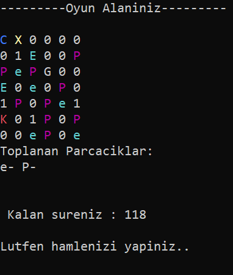

# Antimatter Labyrinth Game

## Overview
This labyrinth game is set in an environment with various particles, where the player tries to reach an exit to produce antimatter hydrogen.

## Game Rules and Objectives
1. The paths in the labyrinth contain the following particles:
   - `P+`: proton
   - `e-`: electron
   - `P-`: antiproton
   - `e+`: positron

2. The objective is to use only `P-` and `e+` particles to reach the exit of the labyrinth.

3. When any particle comes into contact with its oppositely charged antiparticle, they annihilate each other.

4. Black holes are represented by `K`. If a cell with a black hole is traversed, the game ends.

5. If the user cannot reach the exit within a certain game time, the game ends.

## Game Screen

## Controls
- Up Arrow: Move Up
- Left Arrow: Move Left
- Down Arrow: Move Down
- Right Arrow: Move Right